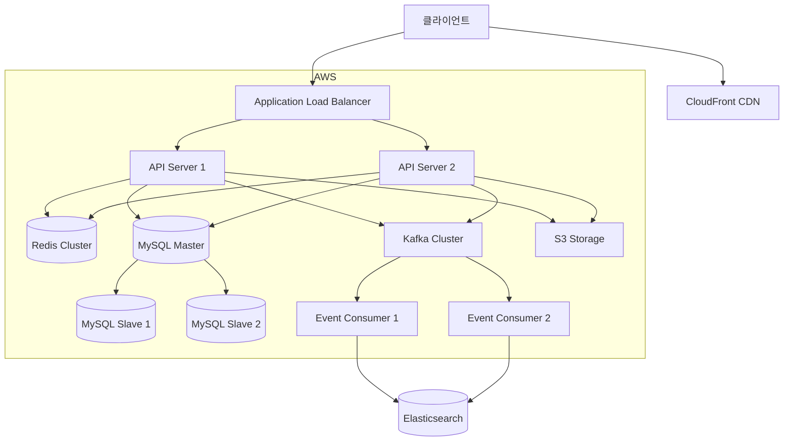

# 아키텍처 설계 문서

## 1. 전체 시스템 아키텍처



### 1.1 핵심 컴포넌트
- **API Server**: Spring Boot 기반 RESTful API 서버
- **Cache Layer**: Redis를 활용한 캐시 계층
- **Database**: MySQL (Master-Slave 구성)
- **Message Queue**: Kafka를 통한 비동기 처리
- **Storage**: AWS S3 파일 저장소
- **CDN**: CloudFront를 통한 정적 리소스 제공

## 2. 상세 설계

### 2.1 계층형 아키텍처
```
src/
├── main/
│   ├── java/
│   │   └── com/survey/
│   │       ├── domain/          # 도메인 계층
│   │       │   ├── survey/      # 설문 도메인
│   │       │   ├── response/    # 응답 도메인
│   │       │   └── user/        # 사용자 도메인
│   │       ├── global/          # 공통 설정
│   │       │   ├── config/      # Spring 설정
│   │       │   ├── error/       # 예외 처리
│   │       │   └── util/        # 유틸리티
│   │       └── infra/           # 인프라 계층
│   │           ├── cache/       # Redis 설정
│   │           ├── messaging/   # Kafka 설정
│   │           └── storage/     # S3 설정
│   └── resources/
└── test/
```

### 2.2 도메인 주도 설계(DDD) 적용

#### 2.2.1 도메인 모델
```java
@Aggregate
public class Survey {
    @AggregateIdentifier
    private final SurveyId id;
    private final List<Question> questions;
    private SurveyStatus status;

    public void publish() {
        // 도메인 로직
    }
}
```

#### 2.2.2 CQRS 패턴
- Command 모델: 설문 생성, 수정, 응답 제출
- Query 모델: 설문 조회, 통계 조회

### 2.3 인프라 구성
#### 2.3.1 데이터베이스
- Master-Slave 복제
   - Master: 쓰기 작업
   - Slave: 읽기 작업
- Connection Pool: HikariCP
- 샤딩 전략: 설문 ID 기반

#### 2.3.2 캐싱 전략
- 로컬 캐시: Caffeine
- 분산 캐시: Redis Cluster
- 캐시 정책: Write-Through

#### 2.3.3 메시지 큐
- Kafka Topics
   - survey-events: 설문 관련 이벤트
   - notification: 알림 메시지

- Consumer Groups: 확장성 고려

## 3. 성능 최적화
### 3.1 데이터베이스
- 인덱스 전략
- 쿼리 최적화
- 커넥션 풀 관리

### 3.2 캐싱
```java
@Cacheable(value = "surveys", key = "#surveyId")
public SurveyDto getSurvey(Long surveyId) {
    // 캐시 미스 시 DB 조회
}
```

### 3.3 비동기 처리
```java
@Async
public CompletableFuture<Void> processSurveyResponse(ResponseDto dto) {
    // 비동기 처리 로직
}
```

## 4. 확장성 고려사항
### 4.1 수평적 확장
- 무상태(Stateless) 서버 설계
- 세션 관리: Redis Session Storage
- 로드 밸런싱: Round Robin

### 4.2 데이터 확장
- 데이터베이스 샤딩
- 읽기 복제본 확장
- 캐시 클러스터 확장

## 5. 모니터링 및 운영
### 5.1 모니터링 지표
- 시스템 메트릭: CPU, Memory, Disk
- 애플리케이션 메트릭: 응답시간, 처리량
- 비즈니스 메트릭: 설문 생성수, 응답률

### 5.2 로깅
```java
@Slf4j
public class SurveyService {
    public void createSurvey(SurveyDto dto) {
        MDC.put("requestId", UUID.randomUUID().toString());
        log.info("Creating survey: {}", dto);
        // 비즈니스 로직
    }
}
```

### 5.3 장애 대응
- Circuit Breaker 패턴
- Fallback 메커니즘
- 재시도 전략

## 6. 보안
### 6.1 인증/인가
- JWT 기반 인증
- Role 기반 접근 제어
- OAuth2 지원

### 6.2 데이터 보안
- 암호화 전략
- XSS 방지
- SQL Injection 방지