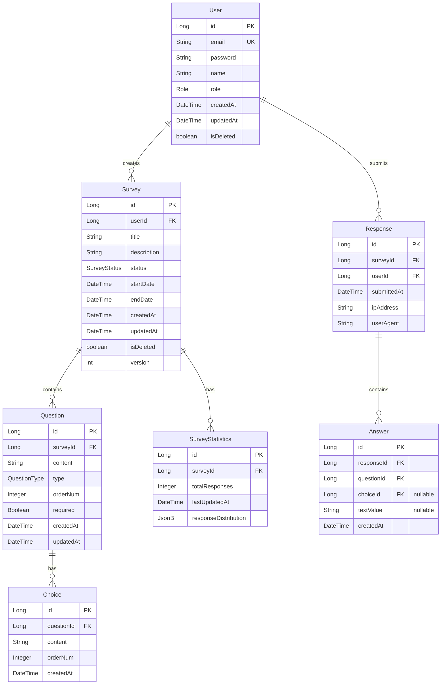

# ERD 설계 문서

## 개요
설문조사 플랫폼의 데이터베이스 설계 문서입니다. 대용량 트래픽과 데이터 처리를 고려한 확장 가능한 구조로 설계했습니다.

## 1. 논리적 데이터 모델

### 1.1 ERD 다이어그램


## 2. 물리적 데이터 모델
### 2.1 테이블 상세 명세

### User (사용자)
| 필드명 | 타입 | 설명 | 제약조건 |
|--------|------|------|-----------|
| id | BIGINT | 기본키 | PK, Auto Increment |
| email | VARCHAR(100) | 이메일 | Unique, Not Null |
| password | VARCHAR(60) | 암호화된 비밀번호 | Not Null |
| name | VARCHAR(50) | 사용자 이름 | Not Null |
| role | VARCHAR(20) | 권한(ADMIN, USER) | Not Null |
| created_at | TIMESTAMP | 생성일시 | Not Null |
| updated_at | TIMESTAMP | 수정일시 | Not Null |
| is_deleted | BOOLEAN | 삭제여부 | Not Null, Default false |

### Survey (설문)
| 필드명 | 타입 | 설명 | 제약조건 |
|--------|------|------|-----------|
| id | BIGINT | 기본키 | PK, Auto Increment |
| user_id | BIGINT | 생성자 ID | FK, Not Null |
| title | VARCHAR(200) | 설문 제목 | Not Null |
| description | TEXT | 설문 설명 | |
| status | VARCHAR(20) | 상태 | Not Null |
| start_date | TIMESTAMP | 시작일시 | Not Null |
| end_date | TIMESTAMP | 종료일시 | Not Null |
| version | INT | 낙관적 락 버전 | Not Null, Default 0 |

## 3. 성능 최적화 전략

### 3.1 인덱스 설계

```sql
-- 사용자 조회 성능 향상
CREATE INDEX idx_user_email ON users (email) WHERE is_deleted = false;

-- 설문 조회 성능 향상
CREATE INDEX idx_survey_status_date ON surveys (status, start_date, end_date);
CREATE INDEX idx_survey_user ON surveys (user_id, created_at);

-- 설문 응답 조회 성능 향상
CREATE INDEX idx_response_survey ON responses (survey_id, submitted_at);

-- 통계 조회 성능 향상
CREATE INDEX idx_answer_metrics ON answers (question_id, choice_id);
```

### 3.2 파티셔닝 전략

```sql
-- 응답 테이블 시간 기반 파티셔닝
CREATE TABLE responses_y2024m01 PARTITION OF responses
    FOR VALUES FROM ('2024-01-01') TO ('2024-02-01');

-- 답변 테이블 설문 ID 기반 파티셔닝
CREATE TABLE answers_p1 PARTITION OF answers
    FOR VALUES FROM (1) TO (1000000);
```

### 3.3 데이터 정합성
- 트랜잭션 격리 수준: READ COMMITTED
- 낙관적 락을 통한 동시성 제어
- Soft Delete 전략 적용

## JPA 엔티티 매핑
### 4.1 기본 엔티티
```java
@Entity
@Table(name = "users")
@Where(clause = "is_deleted = false")
public class User extends BaseTimeEntity {
    @Id @GeneratedValue(strategy = GenerationType.IDENTITY)
    private Long id;
    
    @Column(unique = true, nullable = false, length = 100)
    private String email;
    
    @Column(nullable = false, length = 60)
    private String password;
    
    @Enumerated(EnumType.STRING)
    @Column(nullable = false, length = 20)
    private Role role;
    
    @OneToMany(mappedBy = "user")
    private List<Survey> surveys = new ArrayList<>();
    
    @Column(nullable = false)
    private boolean isDeleted = false;
}
```

### 4.2 성능 최적화
```java
@Entity
@Table(name = "surveys")
public class Survey extends BaseTimeEntity {
    @BatchSize(size = 100)
    @OneToMany(mappedBy = "survey", cascade = CascadeType.ALL)
    private List<Question> questions = new ArrayList<>();
    
    @Version
    private Integer version;
    
    @Formula("(select count(*) from responses r where r.survey_id = id)")
    private Long responseCount;
}
```

## 확장성 고려사항
### 5.1 샤딩 전략
- Survey ID를 기준으로 데이터베이스 샤딩
- 응답 데이터는 시간 기반 파티셔닝

### 5.2 캐싱 전략
- 설문 조회: Redis Cache Aside 패턴
- 통계 데이터: Redis Sorted Set 활용

### 5.3 마이그레이션 전략
- Zero Downtime 마이그레이션
- 블루-그린 배포 방식